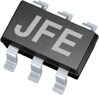

Jfe - Joe’s Framework for Embedded C++ Projects
===============================================

As were »embedded« especially means »bare metal«, with a focus of Cortex-M microcontrollers, for the first mainly Stm32.

But the framework is also designed to build applications for e.g.:

- embedded linux targets
- mobile targets (e.g. Android native)
- linux / unix based PC

Providing some C++ abstractions for e.g.:

- threading
- streams
- logging
- et cetera

Also containing:

- a set of makefiles
- some preperations for Eclipse and Jenkins integration
- C++ Unittest framework (based on Unittest++ 1.4)
- a set of useful utility scripts

Please note, that I prefer to use recent C++ language standards (as far as sensible), to keep the code as clean as possible and even efficient especially for resource contrained bare metal targets.
Because of this, I recomment to use a quite recent C++ compiler. I mainly use gcc.

History
=======

This framework project has is originated at 2008-05-18 while working on a innovative public passenger information system for [EEO GmbH](http://www.eeo-gmbh.de) in Germany, called [Vistra-I](http://www.eeo-gmbh.de/dynamische-fahrgastinformationsanzeiger-vistra-i) (see also [my projects list here](http://www.jme.de/projects.html)). Main target was a [buildroot](https://buildroot.org/) based Avr32, but also aimed to also build for generally all other linux targets (e.g. Ubuntu). Jfe provides some C++ abstraction for:

- threading
- sockets
- persistent logging
- remote access
- command line interface (remote diagnostic / debug console)
- date / time with autark daylight saving control
- configuration persistence
- own tiny smartpointer implementation
- xml parser and composer
- tiny Gpio abstraction

Note, that some of these features currently not available because of huge refactorings and I havn't ported / migrated them completely until now.

Over the years the framework design was heavy influenced from the work on other projects and even on the evolution of the C++ language standard (e.g. C++11).
